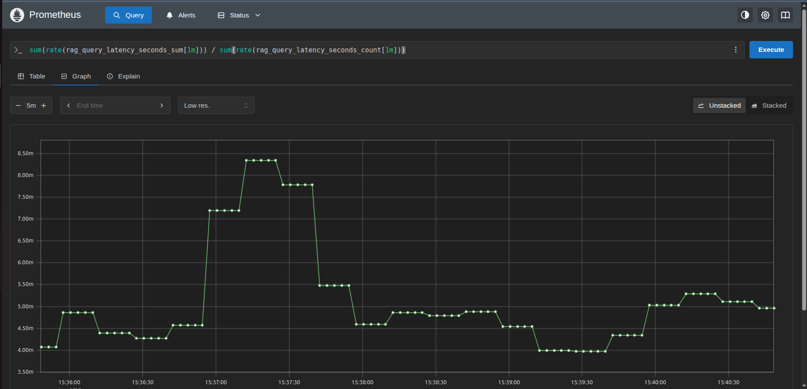
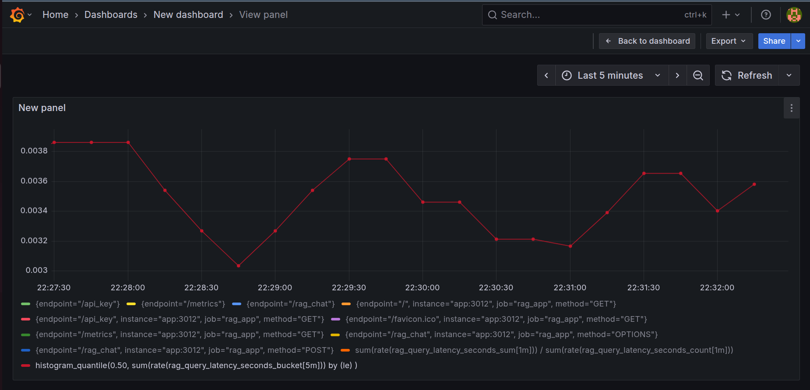
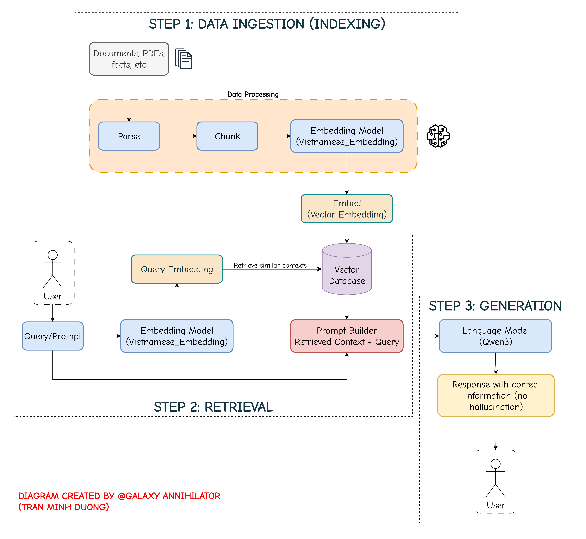

# Legal Contract Analyzer
A MLOps project of an AI-powered RAG Chatbot for understanding and querying legal documents. Together with CI/CD, monitoring and visualization.

## Table of contents
- [Overview](#overview)
- [Demo](#demo)
- [Features](#features)
- [Tech Stack](#tech-stack)
- [Architecture](#architecture)
- [Getting Started](#getting-started)
- [API Endpoints](#api-endpoints)
- [Monitoring](#monitoring)
- [Models Serving](#models-serving)
- [Project Structure](#project-structure)
- [License](#license)
- [Acknowledgements](#acknowledgements)

## Overview

This project is about creating a Retrieval Augmented Generation (RAG) System that can understand your legal documentations (housing contracts, work contracts, etc). I built it for fun, aiming to expand my knowledge in AI Engineering, MLOps, NLP.

With the power of RAG, the answers are now more precise, the LLM experiences less hallucination thanks to the retrieved contexts. This is crucial when dealing with legal documents.

## Demo


[Watch the full demo video](https://youtu.be/kvJwAMWmvj0)

Demo on Render: https://legalcontractanalyzer.onrender.com/

### Monitoring and Visualization with Prometheus + Grafana:





## Features

- [X] Upload your legal contracts in PDF format.
- [X] RAG Chatbot interface.
- [X] Supabase file storage..
- [X] Real-time streaming response.
- [X] Contextual retrieving + querying via ChromaDB.
- [X] CI pipeline with Github Actions.
- [X] CD pipeline with Render.
- [X] Monitoring with Prometheus & Grafana.
- [ ] Evaluation of the system (automated tests, LLM-as-judge).


## Tech Stack

- Backend: FastAPI, OpenAI, FastChat, vLLM
- Frontend: HTML, CSS, JS
- Database: Supabase for PDFs, ChromaDB for vector database
- Model: [Qwen3-0.6B](https://huggingface.co/Qwen/Qwen3-0.6B) for both chat and embeddings
- Monitoring & Visualization: Prometheus & Grafana
- CI/CD Pipeline: Github Actions, Docker, HuggingFace space for deployment

## Architecture

### RAG Pipeline:



## Getting Started

### Clone the repository

```shell
git clone https://github.com/GalaxyAnnihilator/LegalContractAnalyzer

cd LegalContractAnalyzer
```

### Download dependencies

```python
pip install -r requirements.txt
```

### Start up your backend
Use either of these commands:

```python
PYTHONPATH=. python ./backend/main.py
```

or 

```bash
uvicorn backend.main:app --reload --host 0.0.0.0 --port 3012
```

### Access your frontend

Copy the path of the index.html file and paste it into your browser

or

```python
python -m http.server 8080 --directory frontend
```

### Docker Compose (App + Monitoring)

A **docker-compose.yml** is provided to run all the services together.

1. Build the services:

```bash
docker compose build .
```

2. Run all the services

```bash
docker compose up -d
```

3. Access the web app frontend at: http://localhost:8080

Start by uploading a file then ask a question like: "Thời hạn hợp đồng kéo dài trong bao lâu?"

4. Acces the monitoring Grafana at: http://localhost:3000 

*Note*: Username / password for Grafana should be admin / admin, go to Dashboards and select the panel to view metrics

5. Other ports if you're interested:

Backend: http://localhost:3012

Prometheus: http://localhost:9090

## API Endpoints

Available endpoints for backend:

|Methods|Functionality|
|:------|:----------:|
|POST /upload_pdf| Uploads and stores PDF |
|POST /retrieve_documents | Downloads all files from Supabase|
|POST /ingest             | Embeds and stores chunks
|POST /query              | Retrieves top-K chunks for a query
|POST /rag_chat           | Full chat with RAG streaming
|GET  /api_key            | Exposes env vars (for dev)

## Monitoring

In Grafana, I've built a dedicated **Queries Dashboard** to give you real-time insights into your RAG chatbot’s performance and reliability. Here’s what you’ll see:

| **Metrics**| **Description**| **Usage / Use Case**|
|------------|---------------|----------------------|
| **Request Throughput (QPS)**      | Time-series graph showing how many RAG queries per second your service handles.| Spot usage spikes or drops in real-time.|
| **Total Requests Over Time**      | Cumulative counter showing the growth of total user queries.| Understand long-term trends in user activity.|
| **Failure Rate**                  | Gauge or line panel showing percentage of failed RAG calls (errors ÷ total queries).                             | Highlight reliability issues and monitor service health.|
| **Average Latency**               | Single-stat or time-series panel showing average end-to-end response time.     | Track baseline performance and detect slowdowns.|
| **Latency Percentiles** (p50, p95, p99) | Overlayed lines for median, 95th, and 99th percentile response times.| Monitor tail latencies and ensure SLO compliance.     |
| **Latency Distribution Heatmap**  | Heatmap visualizing full latency bucket distribution.   | See response time spread and detect performance outliers.|

=> All of these panels live in one dashboard, giving us a consolidated MLOps view of traffic, errors, and performance for our app.

## Project Structure
```bash
├── backend/
│   ├── chroma_vector_db/
│   ├── downloaded_pdfs/
│   ├── config.py
│   ├── ingest.py
│   ├── main.py
│   ├── query.py
│   ├── retrieve_documents.py
│   ├── test_backend.py
│   └── visualize_chroma.py
│
├── figures/
├── frontend/
│   ├── chat.js
│   ├── file_manager.js
│   ├── get_api_keys.js
│   ├── index.html
│   ├── script.js
│   └── style.css
├── monitoring/
│   ├── prometheus.yml
│   ├── datasources/
│   │   └── prometheus.yml
│   └── dashboards/
│       ├── providers.yml
│       └── rag_dashboard.json
├── .dockerignore
├── .gitignore
├── Dockerfile
├── docker-compose.yml
├── LICENSE
├── README.md
└── requirements.txt
```

## Models Serving (optional)

If you dig deep into the code, you will find the link https://glowing-workable-arachnid.ngrok-free.app/docs as the OpenAI API-like server, this is because I deploy it on my school server and then tunnel via ngrok xD. 

So if you want to start your own model serving server (assuming you have a really strong DGX, H100, A100, or just 3 RTX 3090s like me xD), here's are the steps:

### 1. Installation

#### 1.1 Install FastChat

FastChat is the backend server that can run multiple model workers and serve them via the OpenAI-compatible API.

```bash
# Create and activate virtual environment (optional but recommended)
conda create -n fastchat python=3.10 -y
conda activate fastchat

# Install FastChat
pip install fschat
```

**Tip:** If you want GPU acceleration, make sure PyTorch with CUDA is installed before installing FastChat:
>
> ```bash
> pip install torch --index-url https://download.pytorch.org/whl/cu121
> ```

#### 1.2 Install ngrok

ngrok will allow you to expose your FastChat API to the internet.

```bash
curl -sSL https://ngrok-agent.s3.amazonaws.com/ngrok.asc \
  | sudo tee /etc/apt/trusted.gpg.d/ngrok.asc >/dev/null \
  && echo "deb https://ngrok-agent.s3.amazonaws.com bookworm main" \
  | sudo tee /etc/apt/sources.list.d/ngrok.list \
  && sudo apt update \
  && sudo apt install ngrok
```

If you have troubles downloading ngrok, try visiting their official website: https://ngrok.com/downloads/

Log into [ngrok](https://dashboard.ngrok.com/get-started) and get your auth token:

```bash
ngrok config add-authtoken <YOUR_AUTH_TOKEN>
```

---

### 2. 🖥️ Configurable FastChat Run Script

In the folder /model_serving, check out the file `serve_models.sh` and make it executable:

```bash
chmod +x serve_models.sh
```

---

### 3. Usage Examples

#### Run with defaults (Qwen3-0.6B + Qwen3-Embedding-0.6B)

```bash
./model_serving/serve_models.sh
```

#### Run with custom models, ports, and ngrok URL

```bash
./model_serving/serve_models.sh Qwen/Qwen2-7B Qwen2-7B 21010 \
                  Qwen/Qwen2-Embedding Qwen2-Embedding 21011 \
                  8000 https://mycustomtunnel.ngrok-free.app
```

This will:

* Run `Qwen2-7B` chat model on port `21010`.
* Run `Qwen2-Embedding` embedding model on port `21011`.
* Serve API on port `8000`.
* Tunnel via the given ngrok URL.

---

### 4. 🔍 Testing the API

List all models:

```bash
curl https://YOUR_NGROK_URL/v1/models
```

Or you may access it via a browser, for example: https://glowing-workable-arachnid.ngrok-free.app/v1/models

Get embeddings:

```bash
curl https://YOUR_NGROK_URL/v1/embeddings \
  -H "Content-Type: application/json" \
  -d '{
    "model": "Qwen3-Embedding-0.6B",
    "input": "FastChat is running two models now!"
  }'
```

Chat completion:

```bash
curl https://YOUR_NGROK_URL/v1/chat/completions \
  -H "Content-Type: application/json" \
  -d '{
    "model": "Qwen3-0.6B",
    "messages": [{"role": "user", "content": "Hello from FastChat!"}]
  }'
```

---

### 5. Notes

* Always **set different ports** for each worker.
* `--worker-address` **must match** the worker’s host\:port so FastChat doesn’t overwrite registrations.
* Ngrok **free plan** requires reserving the subdomain before you can set a fixed `--url`. You may go on ngrok website to claim your own free subdomain to use, otherwise, whenever you start a tunnel, it will be a random public url.
* Contact me if you need help ;) I'll be glad to help.


## Licence

[Apache 2.0](./LICENSE)

## Acknowledgement

[@sleepysaki](https://github.com/sleepysaki) for DevOps guidance

